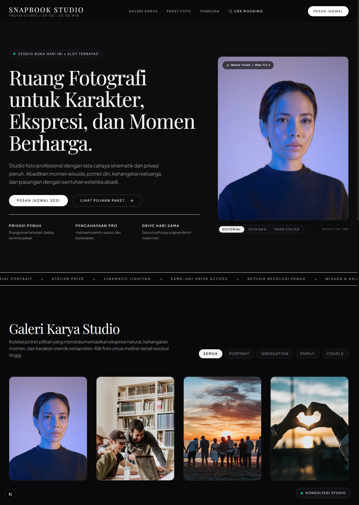
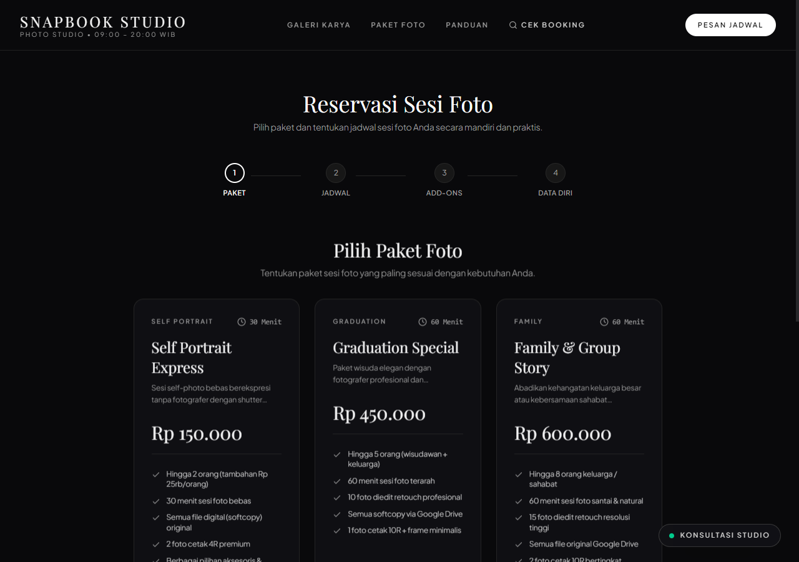
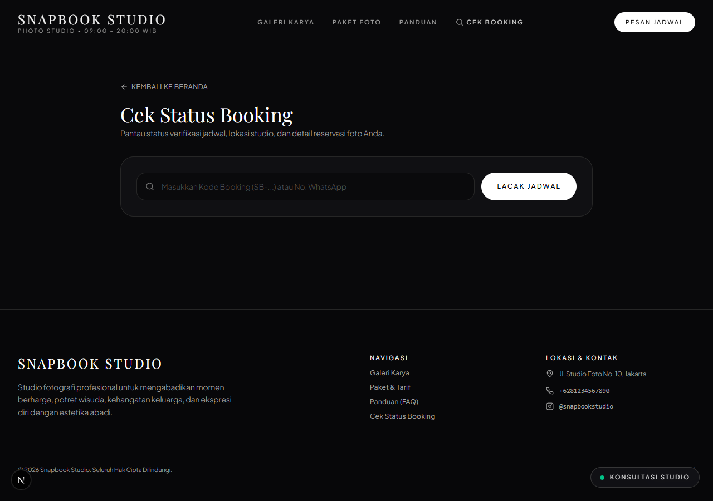
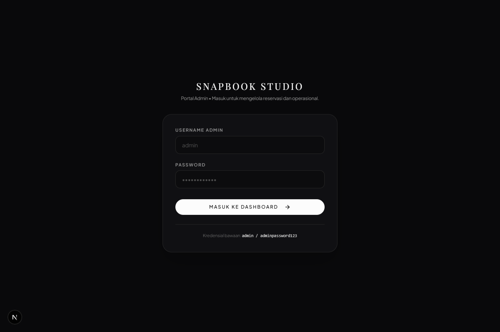

# Snapbook Studio

> **Sistem Reservasi & Portofolio Studio Foto Profesional** bergaya *architectural editorial luxury*. Dilengkapi mesin booking 5-langkah anti-bentrok jadwal, pelacakan mandiri e-receipt untuk klien, dan integrasi WhatsApp instan.

---

## 📸 Pratinjau Tampilan Sistem

### 1. Landing Page & Editorial Atelier
Tampilan beranda bergaya rumah mode mewah (*high-fashion atelier*) dengan tipografi Playfair Display & Plus Jakarta Sans, pita marquee berjalan kontinu, dan pengubah grading pencahayaan interaktif (*interactive tone switcher*).


---

### 2. Galeri Karya & Katalog Tarif Transparan
Galeri pameran kurasi dengan filter kategori dinamis, *interactive exhibition lightbox*, dan kartu paket foto transparan berformat Rupiah tanpa biaya tersembunyi.



---

### 3. Alur Booking 5-Langkah (Anti Double-Booking)
Wizard reservasi mandiri dengan pemilihan tanggal kalender dan pengecekan ketersediaan slot waktu secara *real-time*. Jam yang telah terisi otomatis terkunci (*disabled*) demi mencegah tabrakan jadwal antar klien.



---

### 4. Pelacakan Mandiri & E-Receipt Klien (`/cek-booking`)
Halaman pelacakan status jadwal (*Pending*, *Terkonfirmasi*, *Selesai*) berbasis kode booking atau nomor WhatsApp, dilengkapi rincian biaya, alamat studio, dan panduan kedatangan.



---

### 5. Portal Manajemen Admin (`/admin`)
Pusat kontrol operasional studio terproteksi cookie sesi HTTP-only dan enkripsi bcrypt untuk mengelola seluruh data booking, ketersediaan slot, upload galeri, dan konfigurasi studio.



---

## ⚡ Ringkasan Fitur Unggulan

| Modul | Kemampuan Utama |
|---|---|
| **Public Atelier** | Hero section interaktif, infinite marquee ticker, galeri lightbox modal, integrasi WhatsApp floating pill. |
| **Booking Engine** | Alur 5 tahap (Paket $\rightarrow$ Jadwal $\rightarrow$ Add-ons $\rightarrow$ Data Diri $\rightarrow$ E-Receipt WhatsApp). |
| **Anti-Collision** | Query slot dinamis mencegah dua pelanggan memesan jam yang sama (*race-condition safe*). |
| **Self-Tracking** | Akses mandiri klien untuk memeriksa status reservasi via kode unik `SB-YYYYMMDD-XXXX`. |
| **Admin Back-Office** | Dashboard statistik, tabel filter booking, reminder H-1 WhatsApp otomatis, dan manajemen paket. |

---

## 🚀 Menjalankan Project

```bash
# 1. Pasang dependensi
npm install

# 2. Setup database & isi data awal
npx prisma db push
npm run seed

# 3. Jalankan server lokal
npm run dev
```

Buka di peramban: **`http://localhost:3000`**

### 🔑 Kredensial Admin Bawaan
* **URL Login:** `http://localhost:3000/admin/login`
* **Username:** `admin`
* **Password:** `adminpassword123`
